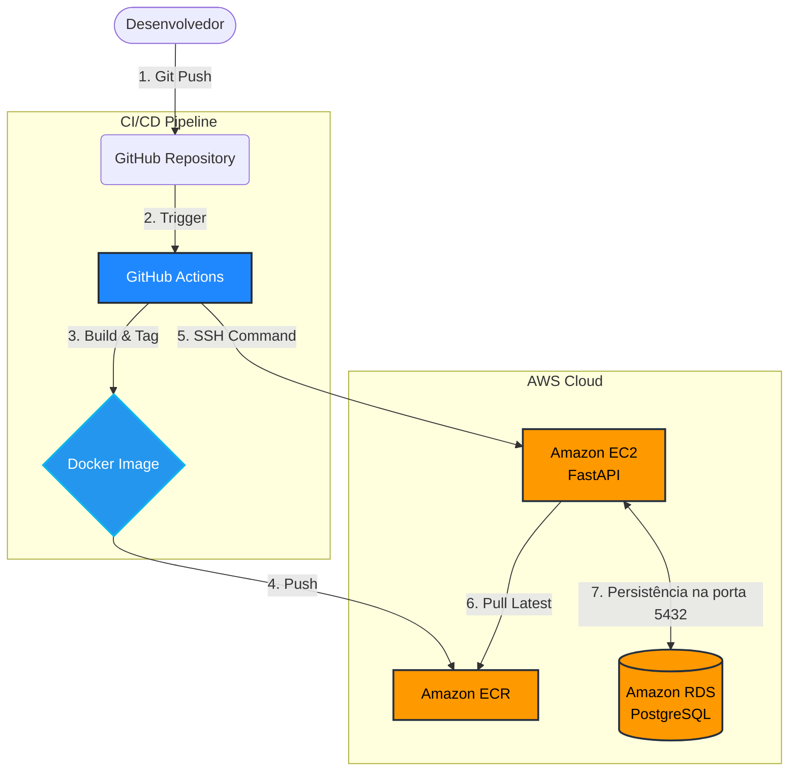

<p align="center">
  
</p>

<h1 align="center">🏊‍♂️ HydroCloud API</h1>
<p align="center">
  <em>Automação e Gestão Inteligente de Tratamento de Água em Nuvem</em>
</p>

<p align="center">
  
  
  
  
  
  
</p>

---

## ⚡ O Problema & A Solução

O controle manual de químicos em piscinas é propenso a erros de cálculo que desperdiçam insumos ou comprometem a qualidade da água. **HydroCloud** resolve isso oferecendo uma API de alta performance que calcula instantaneamente a proporção ideal de **Cloro, Barrilha (Soda Ash) e Floculante** com base no volume de água, registrando todo o histórico de auditoria em um banco relacional seguro.

Mais do que apenas uma API, este projeto demonstra domínio completo de **DevOps, Nuvem e Engenharia de Software**, saindo do código local direto para produção automatizada na AWS.

---

## 🏗️ Arquitetura e Engenharia do Sistema

O fluxo do sistema foi desenhado para garantir resiliência, segurança e **zero intervenção manual (Zero-Touch Deployment)**.



1. **Integração Contínua (CI):** O GitHub Actions valida o código e faz o build da imagem Docker.
2. **Registro de Container:** A imagem é enviada de forma segura para o Amazon ECR.
3. **Entrega Contínua (CD):** O pipeline acessa a instância EC2 via SSH, baixa a nova imagem, mata o container antigo e sobe a nova versão.
4. **Segurança de Rede:** O AWS RDS (PostgreSQL) roda isolado, aceitando conexões *apenas* do IP privado da instância EC2 através de Security Groups.

---

## 📂 Estrutura do Repositório

```text
api-piscina/
├── .github/workflows/
│   └── deploy.yml         # Pipeline CI/CD automatizado
├── src/
│   ├── database.py        # Conexão ORM (SQLAlchemy)
│   └── main.py            # Rotas, regras de negócio e Schemas
├── Dockerfile             # Setup do container da aplicação
├── requirements.txt       # Dependências do projeto
└── README.md
```

---

## ⚙️ Como Executar Localmente

1. **Clone o repositório:**
   ```bash
   git clone [https://github.com/SEU_USUARIO/api-piscina.git](https://github.com/SEU_USUARIO/api-piscina.git)
   cd api-piscina
   ```

2. **Crie e ative o ambiente virtual:**
   ```bash
   python -m venv venv
   source venv/bin/activate  # Mac/Linux
   venv\Scripts\activate     # Windows
   ```

3. **Instale as dependências:**
   ```bash
   pip install -r requirements.txt
   ```

4. **Variável de Ambiente:**
   Configure o banco local (SQLite para testes rápidos):
   ```bash
   export DATABASE_URL="sqlite:///./piscina.db"  # Mac/Linux
   $env:DATABASE_URL="sqlite:///./piscina.db"    # Windows PowerShell
   ```

5. **Inicie a API:**
   ```bash
   uvicorn src.main:app --reload
   ```

---

## 🌐 API & Endpoints

A documentação interativa (Swagger UI) pode ser acessada em `/docs`.

### Calcular e Salvar Tratamento
- **Rota:** `POST /api/piscina/calcular-e-salvar`
- **Descrição:** Calcula as quantidades químicas e salva o registro no PostgreSQL.
- **Payload:**
  ```json
  {
    "volume_litros": 20000
  }
  ```
- **Resposta de Sucesso:**
  ```json
  {
    "mensagem": "Salvo com sucesso!",
    "dados": {
      "id": 1,
      "volume_litros": 20000,
      "cloro_g": 80.0,
      "floculante_ml": 120.0,
      "soda_ash_g": 300.0,
      "data": "2026-08-31T11:15:42"
    }
  }
  ```
